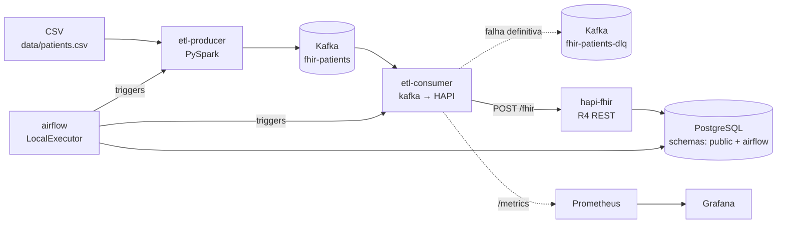

# Arquitetura

## Visão geral

## Componentes

| Container         | Imagem                              | Função                                                                 |
|-------------------|-------------------------------------|------------------------------------------------------------------------|
| `postgres`        | `postgres:15`                       | Banco compartilhado (HAPI no schema `public`, Airflow no schema `airflow` com role dedicada). |
| `hapi-fhir`       | `hapiproject/hapi:latest`           | Servidor FHIR R4 (REST em `/fhir`). Schema gerenciado por Hibernate auto-DDL. |
| `hapi-ready`      | `curlimages/curl`                   | Sentinela que só sai com sucesso quando o HAPI passa no healthcheck.   |
| `kafka`           | `apache/kafka:3.8.0`                | Broker KRaft single-node. Tópicos auto-criados.                        |
| `kafka-ui`        | `provectuslabs/kafka-ui`            | UI para inspecionar tópicos e DLQ.                                     |
| `airflow`         | `apache/airflow:2.10`               | Orquestrador. DAG `fhir_patient_etl` aciona producer → consumer.       |
| `etl-producer`    | build local                         | PySpark CSV → Kafka. Idempotente por design (Kafka log compaction não usado; reprocessamento sobrescreve via If-None-Exist no consumer). |
| `etl-consumer`    | build local                         | Kafka → HAPI com retries, DLQ e métricas Prometheus em `:8001/metrics`. |
| `prometheus`      | `prom/prometheus`                   | Opcional (`--profile monitoring`). Faz scrape do consumer a cada 15s. |
| `grafana`         | `grafana/grafana`                   | Opcional. Dashboard `FHIR Consumer` provisionado.                      |

## Fluxo de dados

1. **Carga**: o CSV (encoding ISO-8859-1, separador `,`) é lido por PySpark.
2. **Normalização**: `etl.lib.transform.build_column_map` mapeia cabeçalhos com acentos/BOM para nomes canônicos. CSV com colunas faltando aborta com `ColumnMappingError` e exit code 2 (o producer não publica nada).
3. **Publicação Kafka**: cada linha vira uma mensagem JSON no tópico `fhir-patients` (ver `docs/message-schema.json`). O producer roda com `acks=all`, `retries=5`, `max_in_flight=1` para preservar ordem.
4. **Consumo**: `etl-consumer` lê em batch, processa por mensagem:
   - Constrói `Patient` (perfil BRIndivíduo) e POSTa com `If-None-Exist: identifier={CPF_SYSTEM}|{cpf}`.
   - Para cada token em `observacao`, constrói `Condition` (SNOMED + ICD-10) e POSTa com `If-None-Exist: subject=Patient/...&code={SNOMED}|...`.
   - HTTP 201 → criado; 200 → já existia; 5xx/429/conn errors → retry com backoff exponencial (5 tentativas).
   - Falha definitiva → mensagem é empurrada para `fhir-patients-dlq` com headers `reason`/`status_code`/`body_preview`.
5. **Commit de offset**: o consumer usa `enable_auto_commit=False` e faz `commit()` explícito após cada mensagem (sucesso ou DLQ).

## Idempotência

- `Patient`: chave de busca é `identifier=<CPF_SYSTEM>|<cpf_normalizado>`. Re-execuções produzem 200 (já existe) e o consumer reaproveita o `id`.
- `Condition`: chave de busca é `subject=Patient/{id}&code=http://snomed.info/sct|{snomed_code}`. Cada par (paciente, código SNOMED) é único.
- Consequência: rodar o DAG várias vezes sobre o mesmo CSV não cria duplicatas.

## Pontos de extensão

- **Mais tipos de Resource**: adicionar builder em `etl/lib/fhir.py`, registrar no consumer, escrever teste em `tests/test_fhir_builders.py`.
- **Outros CSVs**: criar nova entry em `CANONICAL_COLUMNS` ou um perfil alternativo.
- **Multi-broker / produção**: o producer aceita `KAFKA_BROKER=broker1:9092,broker2:9092,...` via env.
- **Schema Registry**: o JSON Schema em `docs/message-schema.json` pode ser registrado num Confluent Schema Registry para validação no broker.
